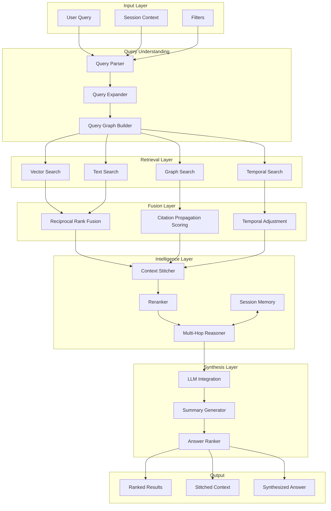

# Context-Aware Research Intelligence Engine

**Design Document**  
**Version**: 1.0  
**Date**: 2026-02-07  
**Status**: Conceptual Design

---

## 1. Vision

Transform PaperForge-rs from a semantic search service into a **context-aware research intelligence layer** capable of:

- Multi-hop reasoning across documents
- Session-aware query refinement
- Citation-based knowledge propagation
- Temporal awareness in search
- LLM-powered synthesis
- Dynamic context stitching

This design takes inspiration from advanced retrieval systems like Augment's context engine while being tailored for research infrastructure.

---

## 2. Architecture Overview



---

## 3. Core Components

### 3.1 Query Understanding

#### Query Parser

```rust
pub struct QueryParser {
    entity_extractor: EntityExtractor,
    intent_classifier: IntentClassifier,
}

#[derive(Debug)]
pub struct ParsedQuery {
    pub raw: String,
    pub entities: Vec<Entity>,
    pub intent: QueryIntent,
    pub temporal_hints: Option<TemporalRange>,
    pub negations: Vec<String>,
}

#[derive(Debug)]
pub enum QueryIntent {
    FactLookup,           // "What is the attention mechanism?"
    ComparisonQuery,      // "BERT vs GPT architecture"
    SurveyRequest,        // "Overview of transformer architectures"
    CitationTraversal,    // "Papers that cite Attention Is All You Need"
    MethodologySearch,    // "How to implement beam search"
    RelatedWorkSearch,    // "Papers related to neural machine translation"
}

impl QueryParser {
    pub async fn parse(&self, query: &str, context: &SessionContext) -> ParsedQuery {
        let entities = self.entity_extractor.extract(query).await;
        let intent = self.intent_classifier.classify(query, &entities).await;
        let temporal = self.extract_temporal_hints(query);
        let negations = self.extract_negations(query);

        ParsedQuery {
            raw: query.to_string(),
            entities,
            intent,
            temporal_hints: temporal,
            negations,
        }
    }
}
```

#### Query Expander

```rust
pub struct QueryExpander {
    synonym_db: SynonymDatabase,
    concept_graph: ConceptGraph,
    session_memory: SessionMemory,
}

impl QueryExpander {
    pub async fn expand(&self, query: &ParsedQuery, session: &SessionContext) -> ExpandedQuery {
        let mut expansions = Vec::new();

        // 1. Synonym expansion
        for entity in &query.entities {
            let synonyms = self.synonym_db.get_synonyms(&entity.text).await;
            expansions.extend(synonyms);
        }

        // 2. Concept expansion (hyponyms, hypernyms)
        for entity in &query.entities {
            let related = self.concept_graph.get_related(&entity.text, 2).await;
            expansions.extend(related);
        }

        // 3. Session-based expansion
        if let Some(context) = session.recent_context() {
            // If user previously searched "transformers", and now asks "attention"
            // we can add context: "transformer attention"
            let session_terms = self.session_memory.get_relevant_terms(session.id).await;
            expansions.extend(session_terms);
        }

        ExpandedQuery {
            original: query.clone(),
            expansions,
        }
    }
}
```

#### Query Graph Builder

```rust
pub struct QueryGraphBuilder {
    entity_linker: EntityLinker,
}

/// Represents a query as a graph of connected concepts
pub struct QueryGraph {
    pub nodes: Vec<QueryNode>,
    pub edges: Vec<QueryEdge>,
}

#[derive(Debug)]
pub struct QueryNode {
    pub id: String,
    pub node_type: QueryNodeType,
    pub weight: f64,
}

#[derive(Debug)]
pub enum QueryNodeType {
    Concept(String),
    Paper(Uuid),
    Author(String),
    Venue(String),
    TimeRange(TemporalRange),
}

impl QueryGraphBuilder {
    pub async fn build(&self, query: &ExpandedQuery) -> QueryGraph {
        let mut nodes = Vec::new();
        let mut edges = Vec::new();

        // Link entities to known papers/authors
        for entity in &query.original.entities {
            if let Some(paper_id) = self.entity_linker.link_to_paper(&entity.text).await {
                nodes.push(QueryNode {
                    id: paper_id.to_string(),
                    node_type: QueryNodeType::Paper(paper_id),
                    weight: 1.0,
                });
            }
        }

        // Connect related concepts
        for (i, node_a) in nodes.iter().enumerate() {
            for (j, node_b) in nodes.iter().enumerate() {
                if i < j {
                    if let Some(relation) = self.find_relation(node_a, node_b).await {
                        edges.push(QueryEdge {
                            from: node_a.id.clone(),
                            to: node_b.id.clone(),
                            relation,
                        });
                    }
                }
            }
        }

        QueryGraph { nodes, edges }
    }
}
```

### 3.2 Multi-Modal Retrieval

#### Vector Search (Semantic)

```rust
pub struct VectorSearcher {
    repo: Repository,
    embedder: Arc<dyn Embedder>,
}

impl VectorSearcher {
    pub async fn search(&self, query: &str, limit: usize) -> Result<Vec<ScoredChunk>> {
        let embedding = self.embedder.embed_query(query).await?;
        self.repo.vector_search(embedding, limit).await
    }
}
```

#### Text Search (BM25)

```rust
pub struct TextSearcher {
    repo: Repository,
}

impl TextSearcher {
    pub async fn search(&self, query: &str, limit: usize) -> Result<Vec<ScoredChunk>> {
        self.repo.bm25_search(query, limit).await
    }
}
```

#### Graph Search (Citations)

```rust
pub struct GraphSearcher {
    repo: Repository,
}

impl GraphSearcher {
    pub async fn search(
        &self,
        seed_papers: Vec<Uuid>,
        hops: u32,
        limit: usize,
    ) -> Result<Vec<ScoredPaper>> {
        let mut scores: HashMap<Uuid, f64> = HashMap::new();
        let mut frontier = seed_papers.clone();

        for hop in 0..hops {
            let decay = 0.5_f64.powi(hop as i32);

            let neighbors = self.repo.get_citations(&frontier).await?;

            for (paper_id, citation_count) in neighbors {
                *scores.entry(paper_id).or_default() += decay * (citation_count as f64).ln();
            }

            // Update frontier for next hop
            frontier = scores.keys().cloned().collect();
        }

        let mut results: Vec<_> = scores.into_iter()
            .map(|(id, score)| ScoredPaper { paper_id: id, score })
            .collect();

        results.sort_by(|a, b| b.score.partial_cmp(&a.score).unwrap());
        results.truncate(limit);

        Ok(results)
    }
}
```

#### Temporal Search

```rust
pub struct TemporalSearcher {
    repo: Repository,
}

impl TemporalSearcher {
    pub async fn search(
        &self,
        base_results: Vec<ScoredChunk>,
        temporal_weight: TemporalWeight,
    ) -> Result<Vec<ScoredChunk>> {
        let now = Utc::now();

        let reweighted: Vec<_> = base_results.into_iter()
            .map(|mut chunk| {
                if let Some(published) = chunk.published_at {
                    let age_days = (now - published).num_days() as f64;

                    let time_factor = match temporal_weight {
                        TemporalWeight::Recent => (-age_days / 365.0).exp(),
                        TemporalWeight::Seminal => (age_days / 365.0).ln().max(0.0),
                        TemporalWeight::Neutral => 1.0,
                    };

                    chunk.score *= time_factor;
                }
                chunk
            })
            .collect();

        Ok(reweighted)
    }
}
```

### 3.3 Fusion Layer

#### Citation Propagation Scoring

```rust
/// Implements a simplified PageRank-inspired citation score propagation
pub struct CitationPropagator {
    repo: Repository,
    damping_factor: f64,
    iterations: u32,
}

impl CitationPropagator {
    pub async fn propagate_scores(
        &self,
        initial_scores: HashMap<Uuid, f64>,
    ) -> Result<HashMap<Uuid, f64>> {
        let mut scores = initial_scores.clone();
        let n = scores.len() as f64;

        for _ in 0..self.iterations {
            let mut new_scores = HashMap::new();

            for (paper_id, _) in &scores {
                let incoming = self.repo.get_citing_papers(*paper_id).await?;
                let outgoing_counts = self.repo.get_outgoing_citation_counts(&incoming).await?;

                let mut contribution = (1.0 - self.damping_factor) / n;

                for citing_paper in incoming {
                    if let Some(&citing_score) = scores.get(&citing_paper) {
                        let out_count = outgoing_counts.get(&citing_paper).unwrap_or(&1);
                        contribution += self.damping_factor * citing_score / (*out_count as f64);
                    }
                }

                new_scores.insert(*paper_id, contribution);
            }

            scores = new_scores;
        }

        Ok(scores)
    }
}
```

### 3.4 Intelligence Layer

#### Context Stitcher

```rust
pub struct ContextStitcher {
    max_tokens: usize,
    overlap_detector: OverlapDetector,
    coherence_scorer: CoherenceScorer,
}

pub struct StitchedContext {
    pub windows: Vec<ContextWindow>,
    pub total_tokens: usize,
    pub cross_references: Vec<CrossReference>,
}

pub struct ContextWindow {
    pub paper_id: Uuid,
    pub paper_title: String,
    pub content: String,
    pub chunk_range: (usize, usize),
    pub relevance_score: f64,
}

impl ContextStitcher {
    pub async fn stitch(
        &self,
        chunks: Vec<ScoredChunk>,
        query: &str,
    ) -> Result<StitchedContext> {
        // Group by paper
        let by_paper = self.group_by_paper(chunks);

        let mut windows = Vec::new();
        let mut token_budget = self.max_tokens;

        for (paper_id, paper_chunks) in by_paper {
            // Find contiguous regions
            let regions = self.find_contiguous_regions(&paper_chunks);

            for region in regions {
                // Merge adjacent chunks
                let merged = self.merge_region(&region);

                // Check if fits in budget
                let tokens = self.count_tokens(&merged.content);
                if token_budget >= tokens {
                    windows.push(ContextWindow {
                        paper_id,
                        paper_title: region.paper_title.clone(),
                        content: merged.content,
                        chunk_range: merged.range,
                        relevance_score: region.avg_score,
                    });
                    token_budget -= tokens;
                }
            }
        }

        // Find cross-references between windows
        let cross_refs = self.find_cross_references(&windows).await?;

        Ok(StitchedContext {
            windows,
            total_tokens: self.max_tokens - token_budget,
            cross_references: cross_refs,
        })
    }

    async fn find_cross_references(&self, windows: &[ContextWindow]) -> Result<Vec<CrossReference>> {
        let mut refs = Vec::new();

        for (i, window_a) in windows.iter().enumerate() {
            for (j, window_b) in windows.iter().enumerate() {
                if i < j {
                    // Check if window_a cites window_b or vice versa
                    if self.mentions_paper(&window_a.content, &window_b.paper_title) {
                        refs.push(CrossReference {
                            from_window: i,
                            to_window: j,
                            reference_type: ReferenceType::Citation,
                        });
                    }

                    // Check for conceptual overlap
                    let overlap = self.overlap_detector.detect(&window_a.content, &window_b.content);
                    if overlap > 0.3 {
                        refs.push(CrossReference {
                            from_window: i,
                            to_window: j,
                            reference_type: ReferenceType::ConceptualOverlap(overlap),
                        });
                    }
                }
            }
        }

        Ok(refs)
    }
}
```

#### Multi-Hop Reasoner

```rust
pub struct MultiHopReasoner {
    retriever: Arc<dyn Retriever>,
    session_memory: SessionMemory,
    max_hops: u32,
}

pub struct ReasoningChain {
    pub hops: Vec<ReasoningHop>,
    pub final_answer_candidates: Vec<AnswerCandidate>,
}

pub struct ReasoningHop {
    pub query: String,
    pub retrieved: Vec<ScoredChunk>,
    pub extracted_facts: Vec<Fact>,
    pub next_query: Option<String>,
}

impl MultiHopReasoner {
    pub async fn reason(
        &self,
        initial_query: &str,
        context: &StitchedContext,
    ) -> Result<ReasoningChain> {
        let mut hops = Vec::new();
        let mut current_query = initial_query.to_string();

        for hop_num in 0..self.max_hops {
            // Retrieve for current query
            let retrieved = self.retriever.retrieve(&current_query, 10).await?;

            // Extract facts
            let facts = self.extract_facts(&retrieved);

            // Determine if we need another hop
            let next_query = self.determine_next_query(&facts, initial_query, hop_num);

            hops.push(ReasoningHop {
                query: current_query.clone(),
                retrieved,
                extracted_facts: facts,
                next_query: next_query.clone(),
            });

            match next_query {
                Some(q) => current_query = q,
                None => break,
            }
        }

        // Aggregate facts into answer candidates
        let candidates = self.generate_answer_candidates(&hops).await?;

        Ok(ReasoningChain {
            hops,
            final_answer_candidates: candidates,
        })
    }

    fn determine_next_query(
        &self,
        facts: &[Fact],
        original_query: &str,
        hop_num: u32,
    ) -> Option<String> {
        // Check if we have answered the original query
        if self.is_query_answered(facts, original_query) {
            return None;
        }

        // Generate follow-up query based on gaps
        let gaps = self.identify_knowledge_gaps(facts, original_query);

        if gaps.is_empty() {
            None
        } else {
            Some(self.formulate_follow_up_query(&gaps[0]))
        }
    }
}
```

#### Session Memory

```rust
pub struct SessionMemory {
    redis: Redis,
    ttl: Duration,
}

#[derive(Serialize, Deserialize)]
pub struct SessionState {
    pub id: String,
    pub queries: Vec<QueryRecord>,
    pub viewed_papers: Vec<Uuid>,
    pub preferred_topics: HashMap<String, f64>,
    pub temporal_preference: TemporalWeight,
}

#[derive(Serialize, Deserialize)]
pub struct QueryRecord {
    pub query: String,
    pub timestamp: DateTime<Utc>,
    pub results_clicked: Vec<Uuid>,
    pub dwell_time_ms: HashMap<Uuid, u64>,
}

impl SessionMemory {
    pub async fn update(&self, session_id: &str, update: SessionUpdate) -> Result<()> {
        let key = format!("session:{}", session_id);
        let mut state: SessionState = self.redis.get(&key).await?.unwrap_or_default();

        match update {
            SessionUpdate::Query { query, results } => {
                state.queries.push(QueryRecord {
                    query,
                    timestamp: Utc::now(),
                    results_clicked: vec![],
                    dwell_time_ms: HashMap::new(),
                });
            }
            SessionUpdate::Click { paper_id } => {
                if let Some(last) = state.queries.last_mut() {
                    last.results_clicked.push(paper_id);
                }
                state.viewed_papers.push(paper_id);
            }
            SessionUpdate::DwellTime { paper_id, ms } => {
                if let Some(last) = state.queries.last_mut() {
                    *last.dwell_time_ms.entry(paper_id).or_default() += ms;
                }
            }
        }

        // Update topic preferences based on interactions
        self.update_topic_preferences(&mut state).await?;

        self.redis.set_ex(&key, &state, self.ttl.as_secs()).await?;
        Ok(())
    }

    pub async fn get_context(&self, session_id: &str) -> Result<SessionContext> {
        let state = self.get_state(session_id).await?;

        // Extract relevant context for query enhancement
        let recent_topics = self.extract_recent_topics(&state);
        let relevant_papers = self.identify_relevant_papers(&state);
        let search_pattern = self.detect_search_pattern(&state);

        Ok(SessionContext {
            recent_topics,
            relevant_papers,
            search_pattern,
            temporal_preference: state.temporal_preference,
        })
    }
}
```

### 3.5 LLM Integration Layer

```rust
pub struct LLMSynthesizer {
    llm_client: LLMClient,
    prompt_templates: PromptTemplates,
}

impl LLMSynthesizer {
    pub async fn synthesize(
        &self,
        query: &str,
        context: &StitchedContext,
        reasoning_chain: &ReasoningChain,
    ) -> Result<SynthesizedResponse> {
        // Build prompt with retrieved context
        let prompt = self.build_prompt(query, context, reasoning_chain);

        // Generate response
        let raw_response = self.llm_client.generate(&prompt).await?;

        // Extract citations from response
        let citations = self.extract_citations(&raw_response, context);

        // Score confidence
        let confidence = self.score_confidence(&raw_response, reasoning_chain);

        Ok(SynthesizedResponse {
            answer: raw_response,
            citations,
            confidence,
            reasoning_summary: self.summarize_reasoning(reasoning_chain),
        })
    }

    fn build_prompt(
        &self,
        query: &str,
        context: &StitchedContext,
        reasoning: &ReasoningChain,
    ) -> String {
        format!(r#"
You are a research assistant helping to answer questions based on academic papers.

## Query
{query}

## Retrieved Context
{context}

## Reasoning Chain
{reasoning}

## Instructions
1. Answer the query based ONLY on the provided context
2. Cite sources using [Paper Title] format
3. If the context is insufficient, explicitly state what's missing
4. Highlight any contradictions between sources

## Answer
"#,
            query = query,
            context = self.format_context(context),
            reasoning = self.format_reasoning(reasoning),
        )
    }
}
```

---

## 4. API Design

### 4.1 Intelligent Search Endpoint

```rust
/// POST /v2/intelligence/search
#[derive(Deserialize)]
pub struct IntelligentSearchRequest {
    pub query: String,
    pub session_id: Option<String>,
    pub options: SearchOptions,
}

#[derive(Deserialize)]
pub struct SearchOptions {
    pub mode: IntelligenceMode,
    pub max_hops: Option<u32>,
    pub temporal_weight: Option<TemporalWeight>,
    pub include_reasoning: bool,
    pub include_synthesis: bool,
    pub limit: usize,
}

#[derive(Deserialize)]
pub enum IntelligenceMode {
    Quick,          // Vector search + rerank only
    Standard,       // Hybrid + citation boost
    Deep,           // Multi-hop reasoning
    Synthesis,      // Full LLM synthesis
}

#[derive(Serialize)]
pub struct IntelligentSearchResponse {
    pub results: Vec<SearchResult>,
    pub context: Option<StitchedContext>,
    pub reasoning: Option<ReasoningChain>,
    pub synthesis: Option<SynthesizedResponse>,
    pub session_id: String,
    pub query_understanding: QueryUnderstanding,
    pub processing_time_ms: u64,
}
```

### 4.2 Session Management

```rust
/// POST /v2/sessions
/// Create or resume a session
pub async fn create_session(
    State(state): State<AppState>,
    Json(req): Json<CreateSessionRequest>,
) -> Result<Json<SessionResponse>> {
    let session_id = req.session_id.unwrap_or_else(|| Uuid::new_v4().to_string());

    state.session_memory.initialize(&session_id).await?;

    Ok(Json(SessionResponse { session_id }))
}

/// POST /v2/sessions/{session_id}/events
/// Track user interactions
pub async fn track_event(
    State(state): State<AppState>,
    Path(session_id): Path<String>,
    Json(event): Json<SessionEvent>,
) -> Result<StatusCode> {
    state.session_memory.update(&session_id, event.into()).await?;
    Ok(StatusCode::NO_CONTENT)
}
```

---

## 5. Data Flow Example

### User Journey: "Compare BERT and GPT architectures"

```
1. Query Received
   - raw: "Compare BERT and GPT architectures"

2. Query Understanding
   - intent: ComparisonQuery
   - entities: [BERT, GPT, architectures]
   - expanded: [BERT, Bidirectional Encoder, GPT, Generative Pre-training, Transformer, ...]

3. Multi-Modal Retrieval
   - Vector Search: 50 chunks about BERT/GPT
   - Text Search: 30 chunks with exact terms
   - Graph Search: Papers citing original BERT/GPT papers

4. Fusion
   - RRF merges vector + text results
   - Citation propagation boosts seminal papers
   - Temporal adjustment weights recent comparisons

5. Context Stitching
   - Window 1: Original BERT paper (Sections 3.1, 3.2)
   - Window 2: Original GPT paper (Introduction, Architecture)
   - Window 3: Survey paper comparing both
   - Cross-refs: Window 3 cites Windows 1 and 2

6. Multi-Hop Reasoning
   - Hop 1: "What is BERT architecture?" -> Facts about bidirectional
   - Hop 2: "What is GPT architecture?" -> Facts about autoregressive
   - Hop 3: "Key differences?" -> Comparison facts

7. LLM Synthesis
   - Input: Context + Reasoning Chain
   - Output: Structured comparison with citations

8. Response
   {
     "synthesis": "BERT uses bidirectional attention [Devlin 2019] while GPT uses...",
     "key_differences": [
       { "aspect": "Training objective", "bert": "MLM", "gpt": "CLM" },
       ...
     ],
     "citations": [...],
     "reasoning_path": [...]
   }
```

---

## 6. Performance Considerations

### 6.1 Latency Budget

| Component              | Target  | Strategy                       |
| ---------------------- | ------- | ------------------------------ |
| Query Understanding    | <50ms   | Pre-computed entity index      |
| Vector Search          | <30ms   | HNSW index, connection pool    |
| Text Search            | <20ms   | GIN index, prepared statements |
| Graph Search           | <100ms  | Materialized citation graph    |
| Context Stitching      | <50ms   | In-memory processing           |
| Multi-Hop (per hop)    | <200ms  | Parallel retrieval             |
| LLM Synthesis          | <2000ms | Streaming, caching             |
| **Total (Quick mode)** | <150ms  |                                |
| **Total (Deep mode)**  | <1000ms |                                |
| **Total (Synthesis)**  | <3000ms |                                |

### 6.2 Caching Strategy

```rust
pub struct IntelligenceCache {
    query_cache: Redis,      // Full query results
    embedding_cache: Redis,  // Query embeddings
    session_cache: Redis,    // Session state
    llm_cache: Redis,        // LLM responses
}

impl IntelligenceCache {
    pub async fn get_or_compute<T, F, Fut>(
        &self,
        key: &str,
        ttl: Duration,
        compute: F,
    ) -> Result<T>
    where
        T: Serialize + DeserializeOwned,
        F: FnOnce() -> Fut,
        Fut: Future<Output = Result<T>>,
    {
        if let Some(cached) = self.get(key).await? {
            return Ok(cached);
        }

        let computed = compute().await?;
        self.set(key, &computed, ttl).await?;
        Ok(computed)
    }
}
```

---

## 7. Modular Design Principles

### 7.1 Component Independence

Each component is designed as an independent module that can be:

- Developed independently
- Tested in isolation
- Deployed separately (if needed)
- Replaced with alternatives

### 7.2 Extension Points

```rust
// Define traits for extensibility
pub trait Retriever: Send + Sync {
    async fn retrieve(&self, query: &str, limit: usize) -> Result<Vec<ScoredChunk>>;
}

pub trait Ranker: Send + Sync {
    async fn rank(&self, query: &str, candidates: Vec<ScoredChunk>) -> Result<Vec<ScoredChunk>>;
}

pub trait Synthesizer: Send + Sync {
    async fn synthesize(&self, query: &str, context: &StitchedContext) -> Result<String>;
}

// Plugin system for custom components
pub struct IntelligenceEngine {
    retrievers: Vec<Arc<dyn Retriever>>,
    rankers: Vec<Arc<dyn Ranker>>,
    synthesizer: Arc<dyn Synthesizer>,
}
```

### 7.3 Feature Flags

```rust
pub struct IntelligenceFeatureFlags {
    pub enable_multi_hop: bool,
    pub enable_session_memory: bool,
    pub enable_llm_synthesis: bool,
    pub enable_citation_propagation: bool,
    pub enable_temporal_search: bool,
    pub max_reasoning_hops: u32,
    pub synthesis_model: String,
}
```

---

## 8. Implementation Phases

### Phase 1: Foundation (Weeks 11-12)

- [ ] Query parser with intent classification
- [ ] Query expander with synonyms
- [ ] Basic context stitcher
- [ ] Cross-encoder reranking

### Phase 2: Retrieval Enhancement (Weeks 13-14)

- [ ] Citation propagation scoring
- [ ] Temporal search adjustments
- [ ] RRF implementation
- [ ] Query graph builder

### Phase 3: Intelligence (Weeks 15-16)

- [ ] Session memory
- [ ] Multi-hop reasoner
- [ ] LLM integration
- [ ] Synthesis pipeline

### Phase 4: Optimization (Weeks 17-18)

- [ ] Caching layer
- [ ] Latency optimization
- [ ] Quality evaluation
- [ ] A/B testing framework

---

**Document Status**: Conceptual Design Complete  
**Next Step**: Detailed technical specification per component  
**Owner**: Research Intelligence Team
