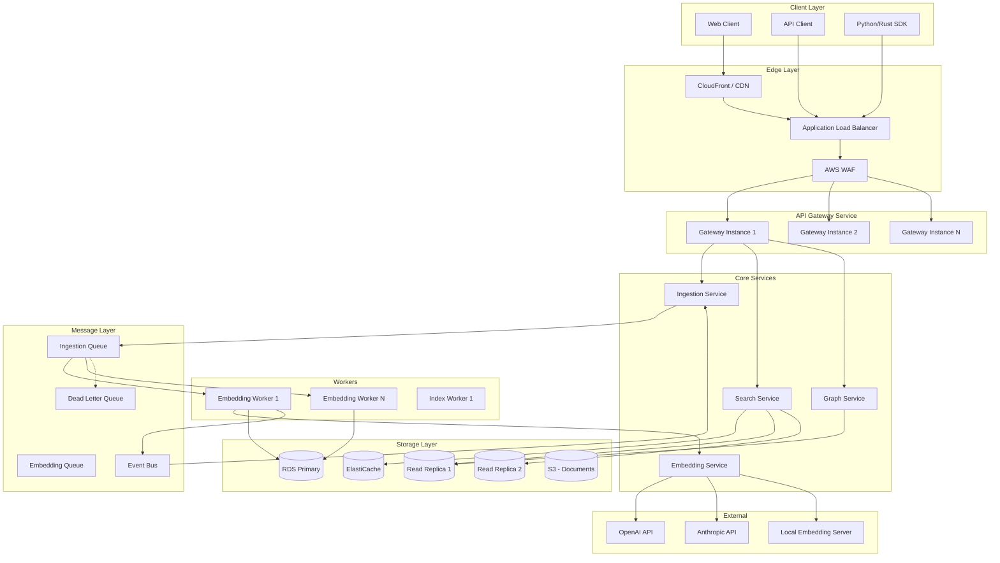

# Product Requirements Document: PaperForge-rs V2

**Version**: 2.0  
**Status**: Production-Grade Specification  
**Author**: Principal Engineer  
**Date**: 2026-02-07  
**Supersedes**: PRD V1.1

---

## 1. Executive Summary

PaperForge-rs V2 is a **production-grade research discovery microservice platform** designed to power semantic search over large-scale academic literature. This version addresses all critical gaps identified in the V1 architecture review, transforming the system from an MVP prototype into a **LabBase-quality research infrastructure service**.

### Key Differentiators (V2)

| V1 (Current)            | V2 (Target)                       |
| ----------------------- | --------------------------------- |
| Monolithic service      | Decomposed microservices          |
| Synchronous ingestion   | Async event-driven pipeline       |
| No authentication       | API key + JWT support             |
| No rate limiting        | Token bucket rate limiting        |
| No circuit breakers     | Full resilience patterns          |
| Basic observability     | OpenTelemetry distributed tracing |
| No embedding versioning | Full model versioning             |
| No citation graph       | Graph data model                  |
| Single database         | Read/write separation             |

---

## 2. Strategic Context

### 2.1 Problem Statement

Research discovery systems face compounded challenges:

1. **Semantic Gap**: Keyword search fails for conceptual queries
2. **Scale Challenge**: 10M+ papers with 100M+ chunks at production scale
3. **Model Drift**: Embedding models evolve, breaking index coherence
4. **Context Fragmentation**: Chunking loses cross-document relationships
5. **Reliability Requirements**: Research workflows demand 99.9% uptime

### 2.2 Core Objectives (V2 Additions)

| ID  | Objective          | Success Metric                      |
| --- | ------------------ | ----------------------------------- |
| O1  | Semantic precision | MRR@10 > 0.75 on research benchmark |
| O2  | High availability  | 99.9% uptime SLA                    |
| O3  | Scalable ingestion | 1000 papers/minute sustained        |
| O4  | Low latency search | P99 < 150ms at 500 QPS              |
| O5  | Model-agnostic     | Support 3+ embedding providers      |
| O6  | Research graph     | 2-hop citation traversal < 200ms    |
| O7  | Multi-tenant ready | Isolated data per tenant            |

### 2.3 Non-Functional Requirements (Enhanced)

| Category          | Requirement     | Target                      |
| ----------------- | --------------- | --------------------------- |
| **Latency**       | Search P50      | < 50ms                      |
| **Latency**       | Search P99      | < 150ms                     |
| **Latency**       | Ingest ack time | < 100ms (async)             |
| **Throughput**    | Search QPS      | 500 per node                |
| **Throughput**    | Ingest rate     | 1000 papers/min             |
| **Availability**  | Uptime          | 99.9%                       |
| **Durability**    | Data loss       | Zero (after ack)            |
| **Scalability**   | Max papers      | 50M                         |
| **Scalability**   | Max chunks      | 500M                        |
| **Security**      | Auth            | API Key, JWT, mTLS internal |
| **Observability** | Trace coverage  | 100% sampled                |

---

## 3. System Architecture (V2)

### 3.1 Service Topology



### 3.2 Service Responsibilities

| Service               | Responsibility                          | Scaling Strategy            |
| --------------------- | --------------------------------------- | --------------------------- |
| **API Gateway**       | Auth, rate limit, routing, validation   | Horizontal (3-10 instances) |
| **Ingestion Service** | Paper CRUD, chunking, job tracking      | Horizontal (2-5 instances)  |
| **Search Service**    | Query embedding, vector search, ranking | Horizontal (5-20 instances) |
| **Graph Service**     | Citation traversal, graph queries       | Horizontal (2-5 instances)  |
| **Embedding Service** | Provider abstraction, batching, caching | Vertical + Horizontal       |
| **Embedding Worker**  | Async embedding generation              | Autoscale (1-50 instances)  |

### 3.3 Data Flow Patterns

**Ingestion Flow (Async)**:

```
Client -> Gateway -> Ingestion Service -> SQS -> Worker -> Embedder -> RDS
                          |
                          v
                   Return job_id (100ms)
```

**Search Flow (Sync)**:

```
Client -> Gateway -> Search Service -> Redis Cache?
                          |                    |
                          | (cache miss)       | (cache hit)
                          v                    v
                   Embedder -> RDS -> Rank -> Return
```

---

## 4. Data Model (V2)

### 4.1 Enhanced Schema

```sql
-- Enable extensions
CREATE EXTENSION IF NOT EXISTS vector;
CREATE EXTENSION IF NOT EXISTS "uuid-ossp";
CREATE EXTENSION IF NOT EXISTS pg_trgm;

-- Tenants (Multi-tenant support)
CREATE TABLE tenants (
    id UUID PRIMARY KEY DEFAULT gen_random_uuid(),
    name TEXT NOT NULL UNIQUE,
    api_key_hash TEXT NOT NULL,
    rate_limit_rps INT DEFAULT 100,
    is_active BOOLEAN DEFAULT true,
    created_at TIMESTAMPTZ DEFAULT NOW()
);

-- Papers (Enhanced)
CREATE TABLE papers (
    id UUID PRIMARY KEY DEFAULT gen_random_uuid(),
    tenant_id UUID NOT NULL REFERENCES tenants(id),
    external_id TEXT,  -- DOI, ArXiv ID, etc.
    title TEXT NOT NULL,
    abstract TEXT NOT NULL,
    published_at TIMESTAMPTZ,
    source TEXT,
    metadata JSONB DEFAULT '{}',
    created_at TIMESTAMPTZ DEFAULT NOW(),
    updated_at TIMESTAMPTZ DEFAULT NOW(),

    UNIQUE(tenant_id, external_id)
);

-- Chunks (Enhanced with versioning)
CREATE TABLE chunks (
    id UUID PRIMARY KEY DEFAULT gen_random_uuid(),
    paper_id UUID NOT NULL REFERENCES papers(id) ON DELETE CASCADE,
    chunk_index INT NOT NULL,
    content TEXT NOT NULL,
    embedding vector(768),
    embedding_model TEXT NOT NULL,
    embedding_version INT NOT NULL DEFAULT 1,
    token_count INT,
    char_offset_start INT,
    char_offset_end INT,
    created_at TIMESTAMPTZ DEFAULT NOW(),

    text_search_vector tsvector GENERATED ALWAYS AS (to_tsvector('english', content)) STORED
);

-- Citations (Graph)
CREATE TABLE citations (
    id UUID PRIMARY KEY DEFAULT gen_random_uuid(),
    citing_paper_id UUID NOT NULL REFERENCES papers(id) ON DELETE CASCADE,
    cited_paper_id UUID NOT NULL REFERENCES papers(id) ON DELETE CASCADE,
    citation_context TEXT,
    position_in_paper INT,
    created_at TIMESTAMPTZ DEFAULT NOW(),

    UNIQUE(citing_paper_id, cited_paper_id)
);

-- Ingestion Jobs (Status tracking)
CREATE TABLE ingestion_jobs (
    id UUID PRIMARY KEY DEFAULT gen_random_uuid(),
    tenant_id UUID NOT NULL REFERENCES tenants(id),
    paper_id UUID REFERENCES papers(id),
    status TEXT NOT NULL CHECK (status IN ('pending', 'chunking', 'embedding', 'indexing', 'completed', 'failed')),
    chunks_total INT DEFAULT 0,
    chunks_processed INT DEFAULT 0,
    error_message TEXT,
    idempotency_key TEXT UNIQUE,
    created_at TIMESTAMPTZ DEFAULT NOW(),
    started_at TIMESTAMPTZ,
    completed_at TIMESTAMPTZ
);

-- Embedding Models Registry
CREATE TABLE embedding_models (
    id SERIAL PRIMARY KEY,
    name TEXT NOT NULL UNIQUE,
    provider TEXT NOT NULL,
    dimension INT NOT NULL,
    is_active BOOLEAN DEFAULT true,
    created_at TIMESTAMPTZ DEFAULT NOW()
);

-- Indexes
CREATE INDEX idx_papers_tenant ON papers(tenant_id);
CREATE INDEX idx_papers_external ON papers(tenant_id, external_id);
CREATE INDEX idx_papers_published ON papers(published_at);
CREATE INDEX idx_papers_metadata ON papers USING GIN(metadata);

CREATE INDEX idx_chunks_paper ON chunks(paper_id);
CREATE INDEX idx_chunks_model ON chunks(embedding_model, embedding_version);
CREATE INDEX idx_chunks_embedding_hnsw ON chunks
    USING hnsw (embedding vector_cosine_ops)
    WITH (m = 16, ef_construction = 64);
CREATE INDEX idx_chunks_tsv ON chunks USING GIN(text_search_vector);

CREATE INDEX idx_citations_citing ON citations(citing_paper_id);
CREATE INDEX idx_citations_cited ON citations(cited_paper_id);

CREATE INDEX idx_jobs_tenant_status ON ingestion_jobs(tenant_id, status);
CREATE INDEX idx_jobs_idempotency ON ingestion_jobs(idempotency_key);
```

### 4.2 Partitioning Strategy (>10M Papers)

```sql
-- Partition chunks by embedding model version
CREATE TABLE chunks (
    ...
) PARTITION BY LIST (embedding_model);

CREATE TABLE chunks_ada002 PARTITION OF chunks
    FOR VALUES IN ('ada-002');
CREATE TABLE chunks_ada003 PARTITION OF chunks
    FOR VALUES IN ('ada-003');
CREATE TABLE chunks_local PARTITION OF chunks
    FOR VALUES IN ('local-e5-large');
```

---

## 5. API Specification (V2)

### 5.1 Authentication

All endpoints require authentication via:

```http
Authorization: Bearer <api_key>
X-Tenant-ID: <tenant_uuid>
```

### 5.2 Ingestion API

**`POST /v2/papers`**

Async ingestion with job tracking.

```json
// Request
{
    "idempotency_key": "arxiv:2301.12345",
    "paper": {
        "title": "Attention Is All You Need",
        "abstract": "The dominant sequence transduction models...",
        "source": "arxiv",
        "external_id": "2301.12345",
        "published_at": "2017-06-12T00:00:00Z",
        "metadata": {
            "authors": ["Vaswani", "Shazeer"],
            "keywords": ["transformers", "attention"],
            "doi": "10.1234/example"
        }
    },
    "options": {
        "embedding_model": "ada-002",
        "chunk_strategy": "semantic",
        "chunk_size": 512,
        "chunk_overlap": 50
    }
}

// Response (202 Accepted)
{
    "job_id": "550e8400-e29b-41d4-a716-446655440000",
    "status": "pending",
    "estimated_completion_ms": 5000,
    "poll_url": "/v2/jobs/550e8400-e29b-41d4-a716-446655440000"
}
```

**`GET /v2/jobs/{job_id}`**

```json
// Response
{
  "job_id": "550e8400-e29b-41d4-a716-446655440000",
  "status": "completed",
  "paper_id": "123e4567-e89b-12d3-a456-426614174000",
  "chunks_created": 12,
  "processing_time_ms": 3200,
  "completed_at": "2026-02-07T19:30:00Z"
}
```

### 5.3 Search API

**`POST /v2/search`**

```json
// Request
{
    "query": "transformer architecture attention mechanisms",
    "options": {
        "mode": "hybrid",           // "vector" | "hybrid" | "bm25"
        "limit": 20,
        "offset": 0,
        "rerank": true,
        "rerank_model": "cross-encoder",
        "filters": {
            "published_after": "2020-01-01",
            "source": ["arxiv", "nature"],
            "metadata": {
                "keywords": ["transformers"]
            }
        }
    }
}

// Response
{
    "results": [
        {
            "chunk_id": "...",
            "paper_id": "...",
            "paper_title": "Attention Is All You Need",
            "content": "We propose a new simple network architecture...",
            "similarity_score": 0.923,
            "bm25_score": 12.4,
            "hybrid_score": 0.891,
            "rerank_score": 0.945,
            "highlight": "We propose a new <em>simple network architecture</em>...",
            "metadata": {...}
        }
    ],
    "total_results": 1523,
    "query_embedding_model": "ada-002",
    "processing_time_ms": 45
}
```

### 5.4 Graph API

**`GET /v2/papers/{paper_id}/citations`**

```json
// Response
{
  "paper_id": "...",
  "citing_papers": [
    {
      "paper_id": "...",
      "title": "...",
      "citation_context": "As shown in [1], the transformer...",
      "citation_count": 1423
    }
  ],
  "cited_papers": [
    {
      "paper_id": "...",
      "title": "...",
      "citation_context": "We build on the work of..."
    }
  ]
}
```

**`POST /v2/graph/traverse`**

Multi-hop citation traversal.

```json
// Request
{
    "seed_papers": ["paper-id-1", "paper-id-2"],
    "direction": "both",  // "citing" | "cited" | "both"
    "max_hops": 2,
    "limit_per_hop": 10,
    "score_by": "pagerank"
}

// Response
{
    "nodes": [...],
    "edges": [...],
    "scores": {...}
}
```

---

## 6. Reliability Engineering

### 6.1 Resilience Patterns

| Pattern             | Implementation                   | Component          |
| ------------------- | -------------------------------- | ------------------ |
| **Circuit Breaker** | tower-circuit-breaker            | Embedding client   |
| **Retry**           | tower-retry, exponential backoff | All external calls |
| **Timeout**         | tower-timeout (5s)               | HTTP handlers      |
| **Bulkhead**        | Connection pool limits           | Database           |
| **Load Shedding**   | tower-load-shed                  | API Gateway        |
| **Rate Limiting**   | tower-governor                   | Per-tenant         |

### 6.2 Failure Mode Handling

```rust
// Circuit breaker configuration
CircuitBreakerConfig {
    failure_threshold: 5,
    success_threshold: 3,
    timeout: Duration::from_secs(30),
    half_open_max_requests: 3,
}

// Retry configuration
RetryConfig {
    max_attempts: 3,
    initial_backoff: Duration::from_millis(100),
    max_backoff: Duration::from_secs(5),
    jitter: 0.1,
}
```

### 6.3 Dead Letter Queue Processing

```rust
pub struct DLQProcessor {
    queue: SqsClient,
    max_attempts: u32,
}

impl DLQProcessor {
    pub async fn process_failed_job(&self, job: FailedJob) -> Result<()> {
        if job.attempts >= self.max_attempts {
            // Permanent failure - alert and store for manual review
            self.alert_ops_team(&job).await;
            self.store_permanent_failure(&job).await?;
        } else {
            // Retry with exponential backoff
            let delay = Duration::from_secs(2_u64.pow(job.attempts));
            self.requeue_with_delay(&job, delay).await?;
        }
        Ok(())
    }
}
```

---

## 7. Observability Stack

### 7.1 Metrics (Prometheus)

```rust
// SLI Metrics
metrics::describe_histogram!(
    "paperforge_search_duration_seconds",
    metrics::Unit::Seconds,
    "Search latency histogram"
);

metrics::describe_histogram!(
    "paperforge_embedding_duration_seconds",
    metrics::Unit::Seconds,
    "Embedding generation latency"
);

metrics::describe_counter!(
    "paperforge_ingestion_total",
    metrics::Unit::Count,
    "Total papers ingested"
);

// SLO Buckets
const LATENCY_BUCKETS: &[f64] = &[
    0.01, 0.025, 0.05, 0.1, 0.25, 0.5, 1.0, 2.5, 5.0, 10.0
];
```

### 7.2 Distributed Tracing

```rust
use tracing_opentelemetry::OpenTelemetryLayer;

// Trace all requests with context propagation
#[tracing::instrument(
    skip(state),
    fields(
        tenant_id = %tenant.id,
        query_length = query.len()
    )
)]
async fn search(state: State, tenant: Tenant, query: Query) -> Result<Response> {
    // Automatic span creation and propagation
}
```

### 7.3 Alerting Rules

```yaml
groups:
  - name: paperforge-slo
    rules:
      - alert: HighSearchLatency
        expr: histogram_quantile(0.99, paperforge_search_duration_seconds) > 0.15
        for: 5m
        labels:
          severity: warning
        annotations:
          summary: "Search P99 latency exceeds 150ms"

      - alert: HighErrorRate
        expr: rate(paperforge_errors_total[5m]) / rate(paperforge_requests_total[5m]) > 0.01
        for: 5m
        labels:
          severity: critical
        annotations:
          summary: "Error rate exceeds 1%"

      - alert: EmbeddingServiceDown
        expr: paperforge_embedding_circuit_open == 1
        for: 1m
        labels:
          severity: critical
        annotations:
          summary: "Embedding service circuit breaker open"
```

---

## 8. Security Model

### 8.1 Authentication Tiers

| Tier        | Mechanism           | Use Case                  |
| ----------- | ------------------- | ------------------------- |
| **Public**  | None                | Health check only         |
| **API Key** | X-API-Key header    | External API access       |
| **JWT**     | Bearer token        | Web clients with sessions |
| **mTLS**    | Client certificates | Internal service mesh     |

### 8.2 Authorization

```rust
#[derive(Clone)]
pub struct AuthContext {
    pub tenant_id: Uuid,
    pub permissions: Vec<Permission>,
    pub rate_limit: RateLimit,
}

#[derive(Clone, PartialEq)]
pub enum Permission {
    Read,
    Write,
    Admin,
    GraphTraverse,
}
```

### 8.3 Input Validation

```rust
use validator::Validate;

#[derive(Deserialize, Validate)]
pub struct IngestRequest {
    #[validate(length(min = 1, max = 1000))]
    pub title: String,

    #[validate(length(min = 10, max = 100_000))]
    pub abstract: String,

    #[validate(length(max = 100))]
    pub source: Option<String>,

    #[validate]
    pub metadata: Option<PaperMetadata>,
}

// Global limits
const MAX_PAYLOAD_SIZE: usize = 1_000_000; // 1MB
const MAX_BATCH_SIZE: usize = 100;
```

---

## 9. Deployment Specification

### 9.1 Infrastructure Requirements

| Component     | Dev            | Staging        | Production       |
| ------------- | -------------- | -------------- | ---------------- |
| API Instances | 1              | 2              | 3-10 (autoscale) |
| Workers       | 1              | 2              | 5-50 (autoscale) |
| RDS Primary   | db.t3.medium   | db.r6g.large   | db.r6g.2xlarge   |
| Read Replicas | 0              | 1              | 2-4              |
| ElastiCache   | cache.t3.micro | cache.t3.small | cache.r6g.large  |
| S3            | Standard       | Standard       | Standard         |

### 9.2 Configuration Schema

```toml
[server]
host = "0.0.0.0"
port = 3000
graceful_shutdown_timeout_seconds = 30

[database]
write_url = "${DATABASE_WRITE_URL}"
read_url = "${DATABASE_READ_URL}"
max_connections = 20
min_connections = 5
connect_timeout_seconds = 10

[embedding]
provider = "openai"  # "openai" | "anthropic" | "local"
model = "text-embedding-ada-002"
api_key = "${EMBEDDING_API_KEY}"
timeout_seconds = 30
max_batch_size = 100
circuit_breaker_threshold = 5

[search]
default_limit = 20
max_limit = 100
cache_ttl_seconds = 300
hybrid_vector_weight = 0.7
hybrid_bm25_weight = 0.3

[security]
rate_limit_rps = 100
max_payload_bytes = 1000000
api_key_hash_algorithm = "argon2"

[observability]
log_level = "info"
log_format = "json"
metrics_enabled = true
tracing_enabled = true
tracing_sample_rate = 1.0
otlp_endpoint = "${OTLP_ENDPOINT}"
```

---

## 10. Roadmap

### Phase 1: Production Hardening (Week 1-4)

- Async ingestion pipeline
- Circuit breakers and retries
- Authentication and rate limiting
- Observability stack
- Test coverage >70%
- CI/CD pipeline

### Phase 2: Research Infrastructure (Week 5-10)

- Embedding versioning
- Citation graph
- Hybrid search with RRF
- Query caching
- Multi-tenant isolation
- Read replicas

### Phase 3: Intelligence Layer (Week 11-16)

- Cross-encoder reranking
- Context stitching
- Session memory
- Graph traversal queries
- Streaming ingestion
- SDK releases

### Phase 4: Scale & Enterprise (Week 17-24)

- Table partitioning
- Multi-region
- SOC2 compliance
- Enterprise SSO
- Custom embedding models
- Self-hosted option

---

## Appendix A: Migration from V1

```sql
-- Add new columns to existing schema
ALTER TABLE chunks ADD COLUMN embedding_model TEXT DEFAULT 'ada-002';
ALTER TABLE chunks ADD COLUMN embedding_version INT DEFAULT 1;
ALTER TABLE papers ADD COLUMN metadata JSONB DEFAULT '{}';
ALTER TABLE papers ADD COLUMN external_id TEXT;

-- Create new tables
-- (run schema_v2.sql for full definitions)

-- Backfill embedding model info
UPDATE chunks SET embedding_model = 'ada-002', embedding_version = 1;
```

---

**Document Status**: Approved for Implementation  
**Next Review**: 2026-03-07
